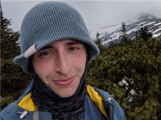

---
hide:
  - navigation
  - footer
---

# About me

Hello! My name is Nick (or VeckoTheGecko) - but you know that already. So let's move onto some things that you might not know!

{ align=left }
I love being in the outdoors - hiking, kayaking, and just generally enjoying nature. I play ultimate frisbee, like dancing, and have a guitar which has a largely ornamental role next to my bed (I'm working on fixing that). Geographically I'm a bit from all over the place - but I'm currently living in Utrecht in the Netherlands (learning Dutch and Dutch sign language). I care deeply about climate change, equality, and other progressive issues. I also believe that loving your job is good for your soul, and that there is so much more to life than any one area.

---

I am also a hell of a nerd, which is something I get to indulge through my work and through my hobbies. I'm a `echo $(($(date "+%Y.+%m./12.-(2000.+10./12.)")))` year old tech enthusiast passionate about working on problems that matter and making the world a better place - a lot of the work I have done thus far is in software engineering for climate research, particularly working with array big data (climate model output and satellite data).

Currently I'm working as a Research Software Engineer at Utrecht University working on [Parcels](https://parcels-code.org/), as well as working on other open source projects. When I feel like I can't get enought coding - I also contribute to open source in my free time - including projects such as [Xarray](https://github.com/pydata/xarray). I am also very interested and have experience in data engineering, AI, and data science.

I am an active member of the following communities:

- [Pangeo](https://pangeo.io/)
- [PyOpenSci](https://www.pyopensci.org/)
- [Scientific Python](https://discuss.scientific-python.org/)
- The Python community more generally (going to local events: Pydata, Pycon etc.)

See below for my resume.

[View CV](./assets/Nick%20Hodgskin%20CV.pdf){ .md-button .md-button--primary target="\_blank"}
